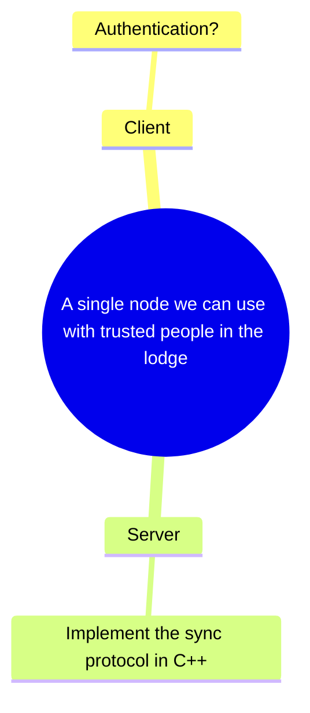

# couloir

Local-first chat app across multiple ESP32 nodes

## TODO

## Running tests

From the root of the project:

    pnpm install
    pnpm test

The [`fake-server`](./fake-server) project contains contract tests that can be run againts a running ESP32 device. To run those tests too, set the `TEST_REAL_SERVER` env var.

    TEST_REAL_SERVER=1 pnpm test

# Layout

# Getting the ESP32-C6 Arduino Server building

1. Install Arduino IDE
2. Add the following URLs to the settings under "additional board manager URLs"

- https://espressif.github.io/arduino-esp32/package_esp32_dev_index.json
- https://raw.githubusercontent.com/espressif/arduino-esp32/gh-pages/package_esp32_index.json

3. Go to the boards manager and search for the "ESP32" extension and install
   that.
4. Yay!
