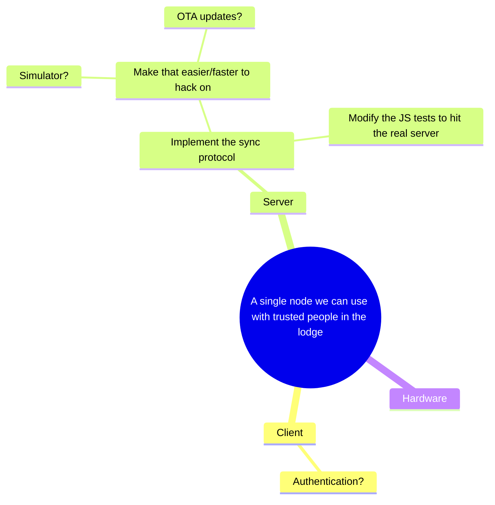

# couloir
Local-first chat app across multiple ESP32 nodes

## TODO

```mermaid
mindmap
  root((A single node we can use with trusted people in the lodge))
    Client
      Authentication?
    Server
      Implement the sync protocol
        Make that easier/faster to hack on
          Simulator?
          OTA updates?
        Modify the JS tests to hit the real server
    Hardware
```
